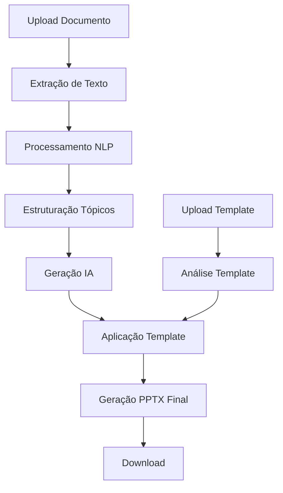

# DocToPPT - Gerador de Apresentações com IA

## Visão Geral

Aplicação Python com interface web que gera apresentações PowerPoint automaticamente usando IA, a partir de documentos de entrada e templates PPTX.

## Requisitos Funcionais

### Entrada de Documentos
- **Formatos suportados**: PDF, Word (.docx), texto (.txt), Markdown (.md)
- **Upload via interface web**: Drag & drop ou seleção de arquivo
- **Processamento inteligente**: Extração e análise automática do conteúdo

### Templates PPTX
- **Upload de template**: Interface para carregar arquivo .pptx como base
- **Preservação de design**: Manter layout, cores, fontes e formatação
- **Substituição de conteúdo**: Aplicar novo conteúdo mantendo estrutura visual

### Integração com IA
- **Configurável**: Suporte para IA remota e local
- **IA Remota**: OpenAI GPT, Claude, outros APIs
- **IA Local**: Ollama, Transformers, modelos offline
- **Flexibilidade**: Configuração via interface web

### Interface e Usabilidade
- **Interface web**: Aplicação Python Flask
- **Configurações simples**: Interface intuitiva para configurações
- **Apresentação estruturada**: Organização automática em tópicos/slides

## Arquitetura Técnica

### Tecnologias Core

#### Backend (Python)
- **Flask**: Framework web principal
- **python-pptx**: Manipulação de arquivos PowerPoint
- **PyPDF2/pdfplumber**: Extração de texto de PDFs
- **python-docx**: Leitura de arquivos Word
- **markdown**: Processamento de arquivos Markdown
- **openai**: Integração com OpenAI API
- **anthropic**: Integração com Claude (opcional)
- **transformers**: Modelos de IA local
- **ollama**: Runtime para modelos locais
- **nltk/spacy**: Processamento de linguagem natural

#### Frontend
- **HTML/CSS/JavaScript**: Interface web responsiva
- **Bootstrap**: Framework CSS
- **Drag & Drop API**: Upload intuitivo de arquivos
- **AJAX**: Comunicação assíncrona com backend

### Estrutura do Projeto

```
presentation-ai-generator/
├── app.py                    # Aplicação Flask principal
├── requirements.txt          # Dependências Python
├── config.py                # Configurações da aplicação
├── .env                     # Variáveis de ambiente (API keys)
├── templates/               # Templates HTML
│   ├── index.html          # Página principal
│   ├── config.html         # Configurações
│   ├── upload.html         # Upload de arquivos
│   ├── processing.html     # Status de processamento
│   └── result.html         # Resultado e download
├── static/                  # Assets estáticos
│   ├── css/
│   │   ├── main.css        # Estilos principais
│   │   └── bootstrap.css   # Bootstrap customizado
│   ├── js/
│   │   ├── main.js         # JavaScript principal
│   │   ├── upload.js       # Lógica de upload
│   │   └── config.js       # Configurações frontend
│   └── uploads/            # Diretório temporário
├── src/                     # Código principal
│   ├── __init__.py
│   ├── document_processor.py    # Processamento de documentos
│   ├── ai_generator.py          # Interface com IA
│   ├── template_processor.py    # Processamento de templates
│   ├── content_analyzer.py      # Análise e estruturação
│   ├── pptx_generator.py        # Geração final do PPTX
│   └── utils.py                 # Utilitários gerais
├── tests/                   # Testes unitários
│   ├── test_document_processor.py
│   ├── test_ai_generator.py
│   └── test_pptx_generator.py
└── examples/                # Exemplos e templates
    ├── templates/           # Templates PPTX de exemplo
    └── documents/           # Documentos de teste
```

### Fluxo de Dados



## Módulos Principais

### 1. Document Processor (document_processor.py)
**Responsabilidade**: Extração e processamento de texto de diferentes formatos

**Funcionalidades**:
- Extração de texto de PDFs (PyPDF2/pdfplumber)
- Leitura de documentos Word (python-docx)
- Processamento de arquivos texto e Markdown
- Limpeza e normalização de texto
- Detecção automática de encoding

**Interface**:
```python
class DocumentProcessor:
    def extract_text(self, file_path: str, file_type: str) -> str
    def clean_text(self, text: str) -> str
    def detect_structure(self, text: str) -> dict
```

### 2. AI Generator (ai_generator.py)
**Responsabilidade**: Interface unificada com diferentes provedores de IA

**Funcionalidades**:
- Conexão com APIs remotas (OpenAI, Claude)
- Integração com modelos locais (Ollama, Transformers)
- Configuração dinâmica de modelos
- Gerenciamento de prompts e templates
- Tratamento de erros e fallbacks

**Interface**:
```python
class AIGenerator:
    def __init__(self, provider: str, model: str, config: dict)
    def generate_outline(self, content: str) -> dict
    def generate_slide_content(self, topic: str, context: str) -> str
    def summarize_content(self, text: str, max_length: int) -> str
```

### 3. Template Processor (template_processor.py)
**Responsabilidade**: Análise e manipulação de templates PPTX

**Funcionalidades**:
- Análise da estrutura do template
- Identificação de layouts disponíveis
- Detecção de placeholders de conteúdo
- Preservação de estilos e formatação
- Mapeamento de slides modelo

**Interface**:
```python
class TemplateProcessor:
    def analyze_template(self, template_path: str) -> dict
    def get_layouts(self) -> list
    def extract_placeholders(self, slide) -> dict
    def preserve_formatting(self, slide) -> dict
```

### 4. Content Analyzer (content_analyzer.py)
**Responsabilidade**: Análise semântica e estruturação de conteúdo

**Funcionalidades**:
- Análise semântica com NLP
- Detecção de tópicos principais
- Hierarquização de conteúdo
- Segmentação para slides
- Geração de títulos e resumos

**Interface**:
```python
class ContentAnalyzer:
    def analyze_content(self, text: str) -> dict
    def extract_topics(self, text: str) -> list
    def create_hierarchy(self, topics: list) -> dict
    def segment_for_slides(self, content: dict) -> list
```

### 5. PPTX Generator (pptx_generator.py)
**Responsabilidade**: Geração final da apresentação

**Funcionalidades**:
- Criação de slides baseados no template
- Aplicação de conteúdo gerado pela IA
- Manutenção de formatação original
- Otimização de layout
- Exportação do arquivo final

**Interface**:
```python
class PPTXGenerator:
    def __init__(self, template_path: str)
    def create_presentation(self, content: dict) -> str
    def add_slide(self, layout: str, content: dict)
    def apply_content(self, slide, content: dict)
    def save_presentation(self, output_path: str)
```

## Configurações da Aplicação

### Configurações de IA
- **Provedor**: OpenAI, Claude, Ollama, Local
- **Modelo**: Específico por provedor
- **Temperatura**: Criatividade da geração (0.0-1.0)
- **Max Tokens**: Limite de tokens por resposta
- **Idioma**: Português, Inglês, outros

### Configurações de Processamento
- **Número máximo de slides**: Limite de slides na apresentação
- **Estilo de apresentação**: Formal, Informal, Técnico, Acadêmico
- **Nível de detalhamento**: Resumido, Médio, Detalhado
- **Incluir gráficos**: Auto-geração de sugestões para gráficos

### Configurações de Template
- **Modo de aplicação**: Substituição completa, Híbrido
- **Preservar elementos**: Imagens, Gráficos, Formatação especial
- **Layout padrão**: Slide padrão quando não há correspondência

## Fluxo de Funcionamento Detalhado

### 1. Fase de Upload
1. Usuário acessa interface web
2. Upload de documento via drag & drop ou seleção
3. Upload de template PPTX
4. Validação de arquivos e formatos
5. Armazenamento temporário seguro

### 2. Fase de Processamento
1. **Extração**: Document Processor extrai texto do documento
2. **Análise**: Content Analyzer identifica estrutura e tópicos
3. **Template**: Template Processor analisa template PPTX
4. **Geração**: AI Generator cria conteúdo estruturado
5. **Status**: Feedback em tempo real para o usuário

### 3. Fase de Geração
1. **Mapeamento**: Relaciona conteúdo com layouts do template
2. **Criação**: PPTX Generator cria slides baseados no template
3. **Aplicação**: Insere conteúdo gerado mantendo formatação
4. **Otimização**: Ajusta layouts e distribui conteúdo
5. **Finalização**: Gera arquivo PPTX final

### 4. Fase de Entrega
1. **Validação**: Verifica integridade do arquivo gerado
2. **Preview**: Opção de visualização antes do download
3. **Download**: Disponibilização do arquivo final
4. **Limpeza**: Remoção de arquivos temporários

## Considerações de Segurança

### Upload de Arquivos
- Validação de tipos de arquivo
- Limite de tamanho de upload
- Verificação de conteúdo malicioso
- Isolamento de arquivos temporários

### API Keys
- Armazenamento seguro em variáveis de ambiente
- Criptografia de chaves sensíveis
- Rotação regular de credenciais
- Logs sem exposição de keys

### Processamento
- Timeout para operações longas
- Limpeza automática de arquivos temporários
- Sanitização de conteúdo gerado
- Limitação de uso por usuário

## Performance e Escalabilidade

### Otimizações
- Cache de resultados de IA para conteúdos similares
- Processamento assíncrono para uploads grandes
- Compressão de arquivos temporários
- Pool de conexões para APIs externas

### Monitoramento
- Logs detalhados de operações
- Métricas de performance
- Alertas para falhas de API
- Dashboard de uso

## Extensibilidade

### Novos Formatos de Documento
- Interface plugável para novos processadores
- Detecção automática de tipo de arquivo
- Configuração de processadores por extensão

### Novos Provedores de IA
- Interface unificada para diferentes APIs
- Sistema de fallback entre provedores
- Configuração dinâmica de modelos

### Personalização de Templates
- Sistema de regras para mapeamento de conteúdo
- Templates inteligentes com metadata
- Biblioteca de templates predefinidos
